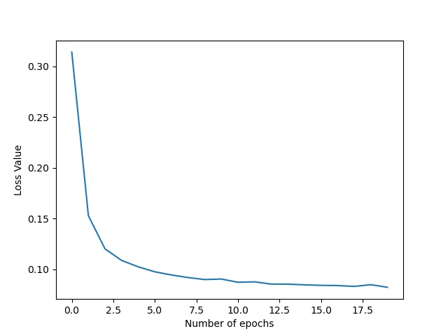

# Vanilla Autoencoder

#### A Vanilla Autoencoder is an autoencoder which learns to reproduce the input from a compressed representation of the output.

#### Used for efficient encoding(compression) of data.
#### The model contains:
* An encoder function g(.) parameterized by ϕ
* A decoder function f(.) parameterized by θ
* The low-dimensional code learned for input x in the bottleneck layer is the output of encoder, let's call it y 
* The reconstructed input is z = g<sub>ϕ</sub>(y)

#### The parameters (θ,ϕ) are learned together to output a reconstructed data sample same as the original input:
#### <div align='center'> x' = f<sub>θ</sub>(g<sub>ϕ</sub>(x)) </div>

#### Our target is to get:
#### <div align='center'> x' ≈ x

#### We have implemented the Vanilla Autoencoder using PyTorch. You need to install these external libraries before running our code: 
* pytorch(for model training)
* matplotlib(for plotting graphs and images)
* tqdm(for showing progress bars)
#### Our model has already been trained on the MNIST dataset. To run our code, Open Terminal and navigate to this directory and run:
```
python vanilla.py
```
#### You can train a new model from scratch or load our pre-trained model to test.
#### Our output on the MNIST Test set was:


#### Our loss function value graph during training:

